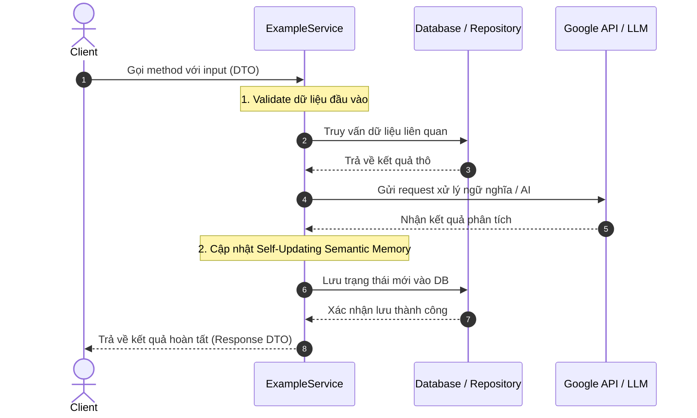

# SERVICE DOCUMENTATION TEMPLATE

## 1. Thông tin chung

- **ID Service:** SER-SV-xxx
- **Tên Service (File):** `example.service.ts`
- **Mô tả chung:** Mô tả ngắn gọn trách nhiệm chính của service này trong hệ thống (Ví dụ: Xử lý đồng bộ, phân tích email và trích xuất giao dịch tài chính).

---

## 2. Chi tiết Method

### 2.1. Tên Method: `exampleMethodName`

- **Mô tả chi tiết:** Mô tả chức năng cụ thể của method này thực hiện những gì, nhận vào dữ liệu gì và trả về kết quả gì.
- **Inputs (Tham số đầu vào):**
  - `param1` (Type): Mô tả tham số 1.
  - `param2` (Type): Mô tả tham số 2.
- **Outputs (Kết quả trả về):**
  - `Promise<ReturnType>`: Mô tả cấu trúc dữ liệu trả về.
- **Dependencies (Inject Services/Repositories):**
  - `private readonly mailService: MailService`
  - `private readonly vectorDbService: VectorDbService`

#### Sơ đồ dòng dữ liệu (Data Flow)

---

## 3. AI tool (Điền mô tả về tool, mục đích sử dụng, sử dụng khi nào)

_(có thể có hoặc không tùy service, ai tools tức nó có thể được sử dụng bởi một service khác và khi code method này thì cần phải thêm annotation @AiTool xem SER-MID-007 kèm description về tool)_
